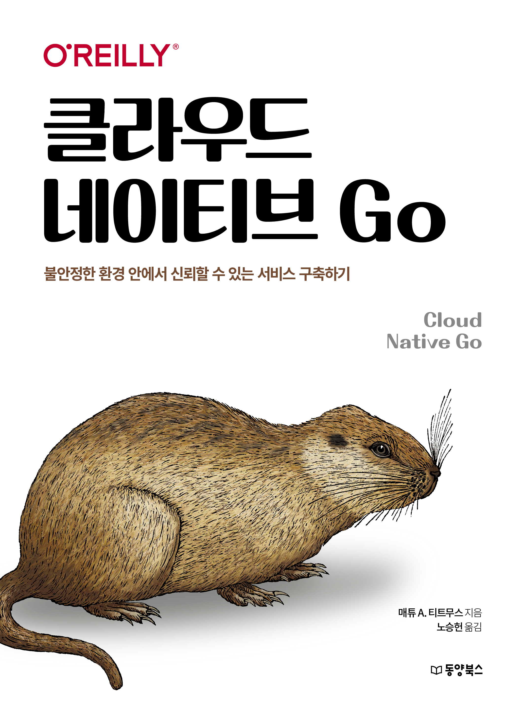

# 『클라우드 네이티브 Go』

동양북스 『클라우드 네이티브 Go』의 깃허브 저장소입니다.

## 구매하기
[교보문고](https://product.kyobobook.co.kr/detail/S000201469459) | [알라딘](https://www.aladin.co.kr/shop/wproduct.aspx?ItemId=314894260) | [YES24](http://www.yes24.com/Product/Goods/118413443) | [인터파크](https://book.interpark.com/product/BookDisplay.do?_method=detail&sc.shopNo=0000400000&sc.prdNo=356724387&sc.saNo=003002001&bid1=search&bid2=product&bid3=title&bid4=001)

## 책 소개

**Go 프로그래밍으로 배우는 클라우드 네이티브 서비스의 모든 것!**  

도커(Docker), 쿠버네티스(Kubernetes), 프로메테우스(Prometheus) 같은 클라우드 네이티브 기술의 공통점은 무엇일까요? 바로 Go라는 프로그래밍 언어로 만들어졌다는 것입니다. 이 책은 Go의 장점을 활용해 예측할 수 없는 환경에서도 확장 가능하면서 탄력적인 클라우드 네이티브 서비스를 개발하는 방법을 알려줍니다. 특히 Go 프로그래밍 언어가 지닌 로 레벨의 특징, 미들레벨의 디자인 패턴, 하이레벨 아키텍처 고려 사항 등에 맞춘 애플리케이션의 구조과 구성을 확인할 수 있습니다.

이 책에서는 Go를 이용해 간단하지만 모든 기능을 갖춘 분산 키-값 저장소를 구축합니다. 저장소를 구축하면서 중급에서 고급 개발자까지 참고할 수 있는 클라우드 네이티브 관리와 배포 문제를 해결하는 모범 사례를 확인할 수 있습니다. 그리고 왜 클라우드 네이티브 서비스를 개발하는 프로그래밍 언어로 Go를 채택했는지를 자연스럽게 알 수 있습니다.

## 기타 사항
정오표는 [이곳](./readme/errata/errata.md)을 참고하기 바랍니다.